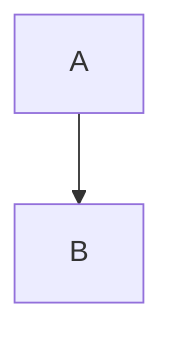

# git flow の使用方法

## 前提環境

- Git 自体はインストール済みとする。

## Git Flow のインストール

```bash
cd
sudo bash
wget -q -O - --no-check-certificate https://github.com/nvie/gitflow/raw/develop/contrib/gitflow-installer.sh | bash
git flow # Confirm whether installation was successful
exit # exit bash as sudoer
```

## Git Flow のコマンド

### 初期化

```bash
git flow init
Which branch should be used for bringing forth production releases?
   - master
Branch name for production releases: [master]
Branch name for "next release" development: [develop]

How to name your supporting branch prefixes?
Feature branches? [feature/]
Release branches? [release/]
Hotfix branches? [hotfix/]
Support branches? [support/]
Version tag prefix? [] v
```

Version tag prefix については、何か指定すると、release ブランチを終了するときに、release ブランチ名に指定のプレフィックスを append したタグを作ってくれる。
例えば、上の例では Version tag prefix を `v` としているが、release ブランチを開始した時の名前に 1.0 と指定していたら、タグが v1.0 で作成される。

### ヘルプ

```bash
git flow help
```

## git-flow によるブランチ利用の流れ

| コマンド | 説明                                                                      |
| :------- | :------------------------------------------------------------------------ |
| start    | ブランチを作成                                                            |
| finish   | ブランチを終了。ブランチの内容を関連するブラ ンチへマージしブランチを削除 |
| publish  | ブランチを共有リポジトリで公開                                            |
| track    | 他の開発者が作成したブランチを共有リポジトリ から取得                     |
| pull     | 共有リポジトリ上のコミットを取得                                          |
| rebase   | ブランチ上でリベースを行う                                                |

## git-flow 使用手順

1. ブランチの作業開始: ブランチを作成し、作業を開始する準備
2. ブランチの共有: 【1】で作成したブランチを共有リポジトリで共有
3. ブランチの取得: 共同作業者は、担当者が作成したブランチを取得し、作業を行う
4. コミットのプッシュ: 共同作業者の作業内容を共有リポジトリで共有
5. コミットの取り込み: 共有リポジトリ上の変更をローカルリポジトリへ取り込み
6. ブランチの作業終了: ブランチでの作業が完了すると、適切なブランチへマージを行い、ブランチを終了

## ブランチの開始方法

feature ブランチを作成するには、次のコマンドを実行します。

```bash
git flow feature start ｛ブランチ名｝
```

develop ブランチの先頭から feature ブランチを作成します。例えば、myfeat ブランチを作成して、作業を行う場合、次のようにします。

```bash
git flow feature start myfeat
```

release ブランチの場合も同様に次のようにして作成できます。

```bash
git flow release start v1.0
```

hotfix ブランチについても、同様にして作成できます。

```bash
git flow hotfix start v1.0.1
```



### feature ブランチの開始と終了

```bash
git flow feature start loginpage
# feature/loginpage というブランチが作成される

# リモートブランチにプッシュ。2回目以降は -u は不要
git push -u origin feature/loginpage

# 色々コミット・プッシュし、物ができたらfeatureブランチを終了。
git flow feature finish loginpage

# developにマージされ、developに切り替わるのでpush
git push origin develop
```

### release ブランチの開始と終了

```bash
# 要領はfeatureブランチとだいたい同じ。
git flow release start 1.0
git push -u origin release/1.0
git commit -m "hogehoge"
git push origin release/1.0
git flow release finish 1.0
# これでv1.0というタグが付く (vをVersion tag prefixに指定している場合)
# ここでは、masterとdevelopにマージされる。releaseブランチ終了後はdevelopに切り替わる。

# まずdevelopをpush
git push origin develop

# masterもpush
git checkout master
git push origin master
```
