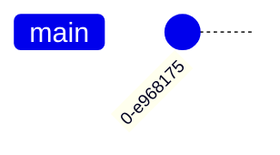

# README

- 👋 Hi, I’m @Yuto-34
- 👀 I’m interested in C++ to attend a Atcoder Beginners Contests.
- 🌱 I’m currently learning PHP for my HP.
- 💞️ I’m looking to collaborate on some people who can teach me PHP and Web App lol
- 📫 How to reach me is [here](https://twitter.com/Yutto_924)

<!---
Yuto-34/Yuto-34 is a ✨ special ✨ repository because its `README.md` (this file) appears on your GitHub profile.
You can click the Preview link to take a look at your changes.
--->

## git flow の使用方法

## 前提環境

- Git 自体はインストール済みとする。

## Git Flow のインストール

```bash
cd
sudo bash
sudo apt install git-flow
git flow # Confirm whether installation was successful
exit # exit bash as sudo
```

## Git Flow のコマンド

### 初期化

```bash
git flow init
Which branch should be used for bringing forth production releases?
   - master
Branch name for production releases: [master]
Branch name for "next release" development: [develop]

How to name your supporting branch prefixes?
Feature branches? [feature/]
Release branches? [release/]
Hotfix branches? [hotfix/]
Support branches? [support/]
Version tag prefix? [] v
```

Version tag prefix については、何か指定すると、release ブランチを終了するときに、release ブランチ名に指定のプレフィックスを append したタグを作ってくれる。
例えば、上の例では Version tag prefix を `v` としているが、release ブランチを開始した時の名前に 1.0 と指定していたら、タグが v1.0 で作成される。

### ヘルプ

```bash
git flow help
```

## git-flow によるブランチ利用の流れ

| コマンド | 説明                                                                      |
| :------- | :------------------------------------------------------------------------ |
| start    | ブランチを作成                                                            |
| finish   | ブランチを終了。ブランチの内容を関連するブラ ンチへマージしブランチを削除 |
| publish  | ブランチを共有リポジトリで公開                                            |
| track    | 他の開発者が作成したブランチを共有リポジトリ から取得                     |
| pull     | 共有リポジトリ上のコミットを取得                                          |
| rebase   | ブランチ上でリベースを行う                                                |

## git-flow 使用手順

1. ブランチの作業開始: ブランチを作成し、作業を開始する準備
2. ブランチの共有: 【1】で作成したブランチを共有リポジトリで共有
3. ブランチの取得: 共同作業者は、担当者が作成したブランチを取得し、作業を行う
4. コミットのプッシュ: 共同作業者の作業内容を共有リポジトリで共有
5. コミットの取り込み: 共有リポジトリ上の変更をローカルリポジトリへ取り込み
6. ブランチの作業終了: ブランチでの作業が完了すると、適切なブランチへマージを行い、ブランチを終了

## 1.ブランチの開始

feature ブランチを作成するには、次のコマンドを実行します。

```bash
git flow feature start ｛ブランチ名｝
```

develop ブランチの先頭から feature ブランチを作成します。例えば、myfeat ブランチを作成して、作業を行う場合、次のようにします。

```bash
git flow feature start myfeat
```

release ブランチの場合も同様に次のようにして作成できます。

```bash
git flow release start v1.0
```

hotfix ブランチについても、同様にして作成できます。

```bash
git flow hotfix start v1.0.1
```



```mermaid
gitGraph:
    branch main
    commit
    branch develop
    commit
    commit
    branch feature
    commit
    checkout develop
    commit
    merge feature
    branch hotfix
    checkout hotfix
    commit "bugfix"
    merge hotfix
    checkout develop
    merge hotfix
    merge develop
```

## 2.ブランチの共有

【1】で作成したブランチを共有リポジトリで共有するには、以下のようにします。

```bash
git flow ｛ブランチ種別｝ publish ｛ブランチ名｝
```

例えば、feature ブランチを共有する場合は、以下のようにします。

```bash
git flow feature publish myfeat
```

release ブランチと hotfix ブランチも同様です。

## 3. ブランチの取得

ブランチの作業を他の担当者と共同で行う場合、他の担当者はブランチの内容を取得する必要があります。

通常の Git の git pull コマンドや git fetch コマンドを利用してブランチを取得することもできますが、git-flow 用のブランチ取得用のコマンドも提供されているので、そちらを使うとよいでしょう。共有リポジトリのブランチを取得するには、次のようにします。

```bash
git flow ｛ブランチ種別｝ track ｛ブランチ名｝
```

例えば、feature ブランチの myfeat ブランチを取得するには、次のようにします。

```bash
git flow feature track myfeat
```

既にブランチを取り込んでいる場合は、プルでコミットを取り込み 、リベースでブランチを奇麗にします。

```bash
git flow feature pull
```

```bash
git flow feature rebase
```

リベースは必須ではありませんが、リベースを行うと奇麗なブランチにすることができます。

## 4. コミットのプッシュ

通常の Git の利用と同じで、コミット内容を共有リポジトリへ送るにはプッシュします。

```bash
git push
```

## 5. コミットの取り込み

先に紹介した「【3】ブランチの取得」の既にブランチを取り込んでいる場合と同様にして、共有リポジトリ上の変更をローカルリポジトリへ取り込みます。

```bash
git flow ｛ブランチ種別｝ pull origin
git flow ｛ブランチ種別｝ rebase
```

## 6. ブランチの作業を終了

ブランチの作業を終了すると、ブランチでのコミット内容は関連するブランチへマージされます。ブランチの作業を終了するときは、ブランチのコードに対して、テストを実行し、正しく動作していることを確認してからマージするとよいです。

```bash
git flow ｛ブランチ種別｝ finish ｛ブランチ名｝
```

例えば、feature ブランチの場合は次のようになります。

```bash
$ git flow feature finish myfeat
Switched to branch 'develop'
Updating 79ac9e8..9797178
Fast-forward
test.txt | 1 +
1 file changed, 1 insertion(+)
Deleted branch feature/myfeat (was 9797178).
Summary of actions:
- The feature branch 'feature/myfeat' was merged into 'develop'
- Feature branch 'feature/myfeat' has been removed
- You are now on branch 'develop'
```

ブランチ終了後、終了した feature ブランチは削除され、カレントブランチが develop ブランチへ変更されます。

```bash
$ git branch
* develop
master
```

カレントブランチが変更されるため、develop ブランチ以外のブランチで作業している場合は、注意してください。

ブランチを終了した場合のマージ先は、連載第 1 回の「いまさら聞けない、成功するブランチモデルと git-flow の基礎知識」で紹介した通り、ブランチ種別により異なります。

## feature ブランチを終了する場合

feature ブランチを終了する場合、図 5 のようにブランチのコミット内容は develop ブランチへマージされます。

## release ブランチを終了する場合

release ブランチを終了する場合は、feature の代わりに release を指定します。

```bash
git flow release finish v1.0
```

release ブランチでは、ブランチを終了すると、リリースソースコードを管理する master ブランチへマージされ、ブランチ名がタグとして付与されます。

## hotfix ブランチを終了する場合

hotfix ブランチを終了する場合は、hotfix を指定します。

```bash
git flow hotfix finish v1.0.1
```

hotfix ブランチの作業内容、緊急リリースとして、master ブランチへマージされタグが付与されます。また、開発中の develop ブランチにも修正内容がマージされます。

### feature ブランチの開始と終了

```bash
git flow feature start login-page
# feature/login-page というブランチが作成される

# リモートブランチにプッシュ。2回目以降は -u は不要
git push -u origin feature/login-page

# 色々コミット・プッシュし、物ができたらfeatureブランチを終了。
git flow feature finish login-page

# developにマージされ、developに切り替わるのでpush
git push origin develop
```

### release ブランチの開始と終了

```bash
# 要領はfeatureブランチとだいたい同じ。
git flow release start 1.0
git push -u origin release/1.0
git commit -m "hogehoge"
git push origin release/1.0
git flow release finish 1.0
# これでv1.0というタグが付く (vをVersion tag prefixに指定している場合)
# ここでは、masterとdevelopにマージされる。releaseブランチ終了後はdevelopに切り替わる。

# まずdevelopをpush
git push origin develop

# masterもpush
git checkout master
git push origin master
```
